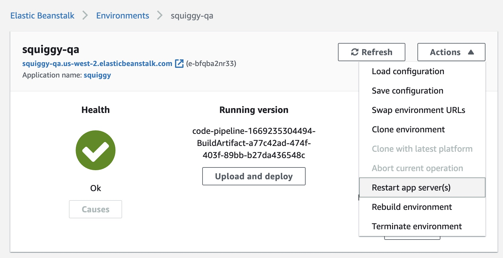

# Copy Squiggy data from prod to a test environment


Push real-world data to a test environment.

## Steps

1. In your ~/.ssh/config file, you need a LocalForward for squiggy-qa and one for squiggy-prod.
These entries allow you to connect to databases via ssh tunnel. For example:
    ```yaml
    Host bastion
      HostName ...
      Port 22
      …
      LocalForward 65432 squiggy-qa.xxxxxxxx.us-west-2.rds.amazonaws.com:5432
      LocalForward 65433 squiggy-prod.xxxxxxxx.us-west-2.rds.amazonaws.com:5432  
    ```
2. Open SSH tunnel to bastion
3. Checkout the latest code from the "qa” branch, or branch of your preference.
    ```shell
    cd  /path/to/squiggy
    git remote add ets https://github.com/ets-berkeley-edu/squiggy.git
    git fetch ets
    git checkout ets/qa
    ```
4. Pull prod data.
    ```shell
    # Replace 00000 with port number of the "prod" LocalForward above.
    ./scripts/hasenpfeffer_incorporated/pull_prod_data.sh \
      -d localhost:00000:squiggy_prod:app_squiggy_readonly \
      [-a] \
      [-c canvas_api_domain [-r replacement_canvas_api_domain]]
   ```
   #### Script options
   ```
   -d  Database connection parameters
   -a  [OPTIONAL] Pull data from the 'canvas' table, in addition to all other tables. Default is FALSE.
   -c  [OPTIONAL] Fetch only courses of the specified canvas_api_domain. For example, 'bcourses.berkeley.edu'.
         Defaults to all canvas_api_domains.
   -r  [OPTIONAL] Repoint canvas_api_domain (specified in 'c' arg above) to canvas_api_domain specified here.
   ```

5. Verify the presence of the CSV files, containing prod data.
    ```shell
    ls -la scripts/hasenpfeffer_incorporated/csv_files
    ```
6. Next, push prod data to test environment.
    ```shell
    # Replace 00000 with port number of the "qa” LocalForward above
    ./scripts/hasenpfeffer_incorporated/push_prod_data.sh \
      -d localhost:00000:squiggy_dev:app_squiggy [-a] [-i]
   ```
   #### Script options
   ```
      -d  Database connection information in the form 'host:port:database:username'
      -a  [OPTIONAL] Push all database tables including the canvas table.
      -i  [OPTIONAL] Mark all courses as inactive after push. This may be desirable
         when populating a test environment.
   ```

   <span style="color: red;">IMPORTANT</span>:
   You will run the `push_prod_data.sh` script and, after you confirm with "consentio",
   it will immediately pause because the script requires a lock on Squiggy db tables.
   In order to proceed, you must restart the squiggy-[dev|qa] app server using Elastic Beanstalk console.
   See the "Restart app server(s)" option in screenshot.

   

7. Finally, verify that _/api/ping_ is happy and that the targeted test environment has a clone of prod data.

Cheerio, mate!
